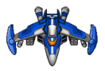
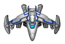
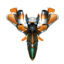

# 飞机大战游戏介绍

## 规则设定与玩法

游戏exe文件（或者下载安装Python环境与pygame库）与图片、音频文件放到同一目录下即可开始游戏**游戏全程一定要保持英文输入法状态！！！刚运行程序时可能会自动变成中文输入状态，要手动shift成英文状态！！**

### 一句话介绍

玩家可以通过“wasd”键来移动自己的飞机，飞机会自动发射子弹，子弹击中敌机时子弹消失同时敌机减少相应的生命值，当玩家的飞机与敌机相撞时游戏结束。游戏分为普通模式与终极模式两种，分数达到10000分时自动切换到终极模式。

### 普通模式

#### 敌机

该模式下共有三种敌机如下：

最先出现蓝飞机，其移动速度中等，血量中等，每击败一个蓝飞机玩家得100分；游戏开始15s后会出现白飞机，其血量低但移动速度非常快，每击败一个蓝飞机玩家得200分；游戏开始40s后会出现红飞机，其血量高但移动速度极慢，每击败一个蓝飞机玩家得500分。在游戏进行100s后，所有敌机的各项指标均增强。

####玩家子弹与补给

该模式下共有四种子弹子弹如下：

其中玩家最初使用的是小子弹，其发射频率、伤害范围与伤害均最低；第二种子弹在玩家得分达到1200分时获得；第三种子弹在玩家得分达到5000分时获得，子弹的各项指标依次增强。

##### 补给

第四种子弹在该模式下不是玩家永久拥有的，而是通过游戏的“补给”获得。“补给”在游戏中每10s掉落一次，其图像如下，当玩家飞机“吃到”补给后，会在现有子弹的基础上，弹道左右各增加一道第四种子弹——该子弹各项指标均最强，持续两秒。

#### 炸弹

玩家初始游戏时自动携带一枚炸弹，以后每30s自动获得一个。当玩家有炸弹时，按下空格键，可以清空全屏的敌人，**但是不加分**。

玩家的炸弹数会显示在屏幕右下角（分数在左上角）。

### 终极模式

当玩家分数达到10000分时，会自动进入终极模式，首先屏幕上会出现警告信息3s，同时切换游戏场景。

玩家在该模式下的移动速度大幅度提升，同时子弹始终为普通模式下“子弹三+左右补给子弹”，保持最强火力。

敌机的规模大幅度增加的同时，额外增加了一种敌机，如图：

该敌机生命值最高，移动速度最慢，同时每隔一定时间该飞机回发射其自己的子弹，当玩家碰到其子弹时也会死亡，子弹如图：

该模式为无尽模式，玩家撞到敌机或敌机子弹时结束游戏。
